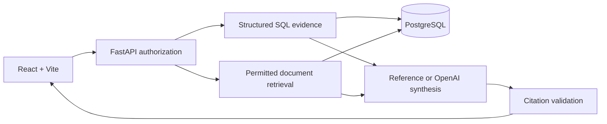

# RAG-Based Financial Fraud Investigation Assistant

An evidence-grounded investigation workspace for suspected account takeover. React + Vite + TypeScript, FastAPI + Pydantic, and PostgreSQL.

**Synthetic demonstration only.** All accounts and activity are synthetic; procedures and historical reports are fictional. The analyst makes the decision. The application cannot freeze accounts, block payments, or determine criminality.

## Working first slice

- An assigned-case inbox and chronological, source-linked evidence timeline.
- Explicit SQL alert rules, exact per-currency totals/counts, and a 30-day comparison window.
- PostgreSQL full-text retrieval over permitted, versioned fictional passages.
- A deterministic **reference brief**, explicitly labeled as non-LLM output, with observations, hypotheses, legitimate explanations, unknowns, next checks, and clickable citations.
- OpenAI structured-output synthesis behind analyst access and a disabled-by-default flag. **Live generation has not been exercised with a real key.**
- Signed analyst sessions and persisted reviews. Public users cannot save reviews or run model calls.
- Tenant RLS, restricted database privileges, case assignments, immutable document versions, evidence cutoffs, cross-process request budgets, and generation accounting.

The seed contains 100 accounts, 5,002 transactions, 1,005 events, one visible investigation, one inaccessible isolation case, 10 procedures, and 6 historical reports (one restricted). Documents are short atomic passages. Device/recipient identifiers live on records; separate normalized tables are a later schema expansion.

**Not yet delivered:** vector/hybrid retrieval, broader case scenarios, real-model quality measurements, hosted PostgreSQL, and the final Vercel/custom-domain deployment. No production-readiness claim is made.

## Local setup

Prerequisites: Node.js 24, npm, [uv](https://docs.astral.sh/uv/getting-started/installation/), and Python 3.12 (`uv python install 3.12`). On Windows, the local PostgreSQL helper can reuse an installed Edge C++ runtime without changing system PATH or installing a service.

```sh
npm ci
npm ci --prefix frontend
cd backend
uv sync --frozen
cd ..
```

In terminal 1, from the repository root:

```sh
npm run db:local
```

This starts real PostgreSQL on `127.0.0.1:55432`, persists data under ignored `.local/`, and creates `backend/.env` with random local credentials **only if it does not exist**. It never prints credentials or overwrites your key. Keep it running.

In terminal 2:

```sh
cd backend
uv run python manage.py migrate
uv run python manage.py seed
uv run uvicorn app.main:app --host 127.0.0.1 --port 8000 --no-access-log
```

In terminal 3, from the repository root:

```sh
npm run dev
```

Open **http://127.0.0.1:5173**. Prepare a reference brief, inspect citations, search retrieved sources, and explore the review boundary. The reference workflow needs no OpenAI key.

For an existing PostgreSQL installation, copy `backend/.env.example` to `backend/.env`. Supply a dedicated `ffia_app` runtime `DATABASE_URL`, separate migration/seed `ADMIN_DATABASE_URL`, and random `AUTH_SECRET` of at least 32 characters. Enable `ENABLE_PUBLIC_DEMO=true` only for synthetic demonstration. Numbered migrations apply once; seeding is idempotent.

## Analyst review

```sh
cd backend
uv run python manage.py token
```

This writes an eight-hour signed session to ignored `.local/analyst-token.txt` without printing it. In the app, click **Demo explorer** and enter that session token. It is **not** the OpenAI key. Browser sessions stay in memory and disappear on reload. This is a local/demo authentication mechanism; production identity-provider integration and revocation remain future work.

## OpenAI integration

Set `OPENAI_API_KEY` in ignored `backend/.env`, never in chat or a `VITE_` variable. Configure `OPENAI_CHAT_MODEL`, then enable `ENABLE_LIVE_GENERATION=true` when ready to test. Restart the backend. The analyst-only **Generate with OpenAI** button uses the same scoped SQL evidence and retrieved passages as the reference workflow.

Calls use the Responses API with a Pydantic schema, no action tools, `store=false`, no automatic retries, a 45-second timeout, and a 4,000-output-token cap. Defaults allow 10 attempts per tenant per UTC day; failed calls consume the attempt budget. Validation checks citation IDs, scope, required sections, and source categories. **It does not prove semantic support.** Failures/refusals are explicit; reference text is never silently substituted for model output.

Token counts are recorded. Dollar estimates require explicitly configured current model prices; otherwise cost is unknown.

## Ingestion and evaluation

```sh
cd backend
uv run python manage.py ingest
uv run python evaluate.py --split dev
uv run pytest -q
uv run ruff check app tests manage.py seed.py ingest.py evaluate.py
```

Ingestion validates metadata, labels fictional passages, computes hashes, preserves versioned IDs, and populates PostgreSQL's weighted full-text index. Changed content requires a new version and explicit publication/ingestion dates. Only the latest available version is ranked; older authorized passages remain resolvable for historical citations.

See [evaluation protocol](evaluation/README.md) and [actual keyword results](evaluation/results/dev-keyword.json). Eight development queries and 36 frozen held-out questions are separate from retrieval and deployment inputs. The held-out set has not yet been run. This is a document-retrieval benchmark, not an unseen-scenario or detection benchmark.

For browser verification, keep services running, issue an analyst token, then run from the repository root:

```sh
npx playwright install chromium
npm run test:e2e
npm run build
```

Tests use a separate `fraud_investigation_test` database. Browser tests cover citations, retrieval, analyst review, and mobile layout. GitHub Actions runs the same checks using ephemeral PostgreSQL with no OpenAI credentials.

## Architecture and deployment



The implementation uses Psycopg and numbered SQL migrations rather than adding an ORM: the first slice's queries are short and explicit. The interface uses React, local CSS, and bundled fonts. These choices keep the system small while preserving the structured-query/retrieval boundary.

The [design](docs/design.md) describes the broader target. [Deployment notes](docs/deployment.md) track the Vercel plan. Intended address: **fraud-investigation.yashjobalia.com**. CareLine remains separate and untouched.
