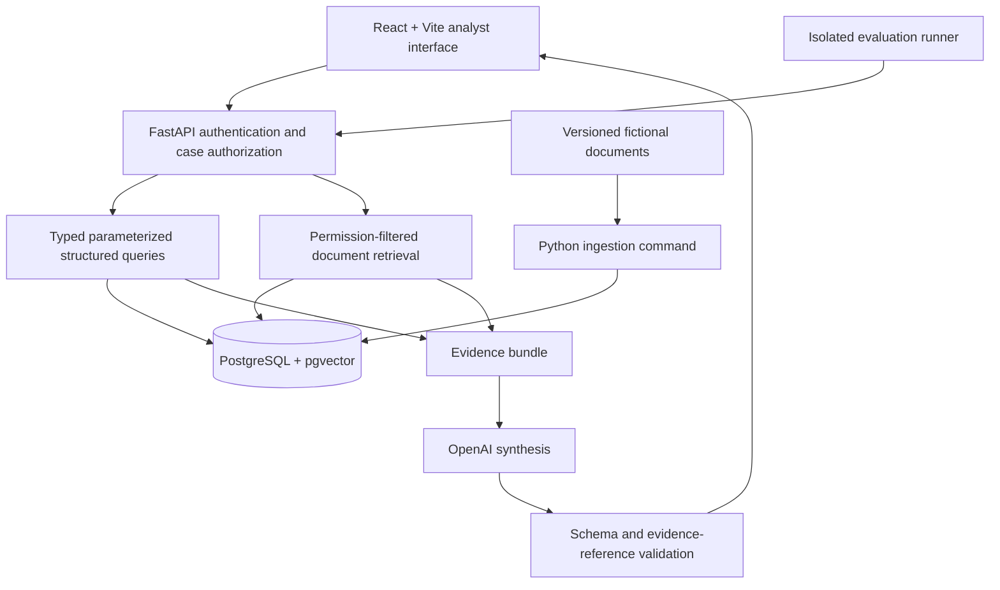

# MVP design proposal

## Smallest complete workflow

Open an alert, inspect its account records and chronological timeline, retrieve relevant procedures and historical reports, generate a cited investigation brief, and record analyst review. Start with one coherent case before extending to ten demonstration cases.

The brief contains alert triggers, observed facts, suspicious indicators, plausible legitimate explanations, related historical reports and procedures, missing information, and suggested next checks. Hypotheses are explicitly distinguished from observations. Citation links open exact records or versioned document passages.

## Architecture

Use SQL for totals, counts, time windows, device/login changes, relationships, and timelines. Explicit versioned rules produce alerts. Document retrieval supplies investigation guidance and historical context. Do not use vector similarity to calculate transaction totals or determine fraud.

Use one frontend and one modular Python backend. Ingestion, seeding, and evaluation are Python commands rather than additional services. No graph database, agent framework, or autonomous multi-agent system is needed.

## Proposed relational schema

All event times use UTC `timestamptz`. Monetary amounts use integer minor units plus currency; never aggregate different currencies without an explicit conversion policy.

| Table | Important fields and relationships |
|---|---|
| tenants | id, name |
| analyst_memberships | tenant_id, identity_subject, role |
| accounts | id, tenant_id, synthetic_customer_id, opened_at |
| devices | id, tenant_id, fingerprint_reference, first_seen_at |
| recipients | id, tenant_id, synthetic_destination_reference |
| transactions | id, tenant_id, account_id, recipient_id, amount_minor, currency, occurred_at, recorded_at, status |
| account_events | id, tenant_id, account_id, device_id nullable, event_type, occurred_at, recorded_at, source, event-specific fields |
| cases | id, tenant_id, account_id, opened_at, evidence_cutoff_at, review_status |
| case_assignments | case_id, identity_subject, access_level |
| alerts | id, case_id, rule_id, rule_version, triggered_at, input_evidence_ids, computed_values |
| briefs | id, case_id, generated_at, retrieval_run_id, model, prompt_version, structured_output |
| reviews | id, case_id, brief_id, identity_subject, reviewed_at, disposition, notes |
| audit_events | id, tenant_id, identity_subject, case_id, operation, occurred_at, outcome |

Foreign keys and constraints enforce tenant-consistent relationships. Permission checks cover collection APIs, individual records, retrieval, generation, and citation resolution. Database access uses restricted roles, with row-level policies as defense in depth; privileged credentials must not silently defeat isolation.

Calculated facts carry a stable derived-evidence ID, query contract/version, parameters, currency, cutoff time, source record IDs, and calculation output. A total's citation must explain its calculation and underlying records.

## Proposed document schema

| Table | Important fields |
|---|---|
| documents | id, tenant_id, kind, title, source_uri, synthetic=true |
| document_versions | id, document_id, version, content_hash, published_at, effective_at, superseded_at nullable, ingested_at |
| document_grants | document_id, authorized role or identity/group |
| document_chunks | id, document_version_id, section_path, ordinal, passage_text, offsets, text_search_vector |
| chunk_embeddings | chunk_id, embedding_model, dimensions, content_hash, embedding |
| retrieval_runs | id, case_id, identity_subject, query, mode, corpus_version, configuration, duration_ms |
| retrieval_results | run_id, chunk_id, rank, score |

Use stable IDs tied to immutable document versions and passage boundaries. Index exact passages, preserve headings, and avoid splitting procedural steps from their conditions. Store indexing/model versions so retrieval experiments are reproducible.

Authorization and evidence cutoff filters apply before passages reach the model. Retrieved text is untrusted evidence, never executable instructions. The model receives a bounded bundle and emits structured claims linked to allowed evidence IDs. Reference validation alone does not establish semantic support; evaluate groundedness separately.

## Synthetic-data generation

Use a fixed random seed, a fixed anchor date, deterministic IDs, and explicit scenario templates. Generate relationships and event sequences first, then derive alert inputs and fictional narrative documents from those records.

Start with one case: a new device login followed by a newly added recipient and an unusually large transfer. Include legitimate evidence such as a recorded replacement-phone notice, without treating it as proof that every subsequent action was authorized. Missing confirmation remains an explicit unknown.

Expand toward 100 accounts, 5,000 transactions, 1,000 login/device events, 30 historical reports, 10 procedures, and 10 demonstration cases. Include travel, replacement devices, planned unusual payments, genuinely ambiguous activity, and suspicious combinations. Validate foreign keys, timestamps, amounts, totals, rule triggers, and narrative consistency.

Store hidden scenario labels, resolutions, and evaluation answers outside the retrievable database/corpus and exclude evaluation fixtures from deployed application bundles. Use separate scenario families for development and held-out evaluation to avoid near-duplicate leakage. Historical reports may have their own fictional outcomes, but must not reveal held-out current-case outcomes.

## Implementation phases and acceptance criteria

1. **Foundation:** separate repository, locked dependencies, migrations, environment templates, documented architecture, and CI. No secrets tracked. Frontend/API contracts validate requests and responses.
2. **Structured case:** reproducible seed loads one coherent case; explicit alert rule produces the alert; SQL returns verified amounts and a stable chronological timeline. Unauthorized case and evidence requests fail.
3. **Keyword retrieval:** ingest versioned procedures/reports, retrieve relevant passages under permissions, and resolve passage citations. A reproducible evaluation example reports observed retrieval results.
4. **Cited brief and review:** backend synthesizes observations, hypotheses, alternatives, missing evidence, and next steps. Validate cited IDs and permissions; clickable citations expose exact evidence. Analyst review is persisted. Test document prompt-injection handling and unanswerable requests.
5. **Measured retrieval expansion:** run keyword, vector, and hybrid on identical corpus snapshots and questions. Freeze 30–50 held-out questions with supporting evidence before tuning; use a separate development set. Report recall@k, MRR/nDCG where suitable, citation correctness/completeness, unsupported claim rate, abstention, permission isolation, latency, and token cost. Do not claim hybrid is better unless the measurements show it. Keep detection metrics separate.
6. **Deployment:** verify local checks and a Vercel preview, connect the requested subdomain, and test the deployed complete workflow. Restrict public demonstration access to synthetic data, control live-generation cost, and report actual results and remaining limits.

The first milestone is phases 1–4 plus a small reproducible evaluation example. Broader evaluation and retrieval comparison follow incrementally. Statistical limitations of a small synthetic benchmark must be documented.
